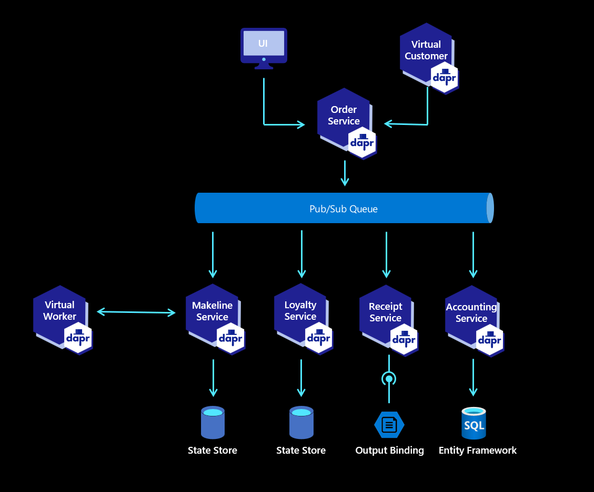

# Slide with Bulleted List

* Denver
* Seattle
* Austin
* Morehead
* New York
    * Brooklyn
    * Manhattan
    * Queens
    

---
# Diagram


<!-- if you want FQDN images -->
<!--  -->
<!--  -->

<!--  -->


<!--  -->

---
# Slide with Code Snippet

```rust
// Cool people use Rust
fn main() {
    // Statements here are executed when the compiled binary is called

    // Print text to the console
    println!("Hello World!");
}
```